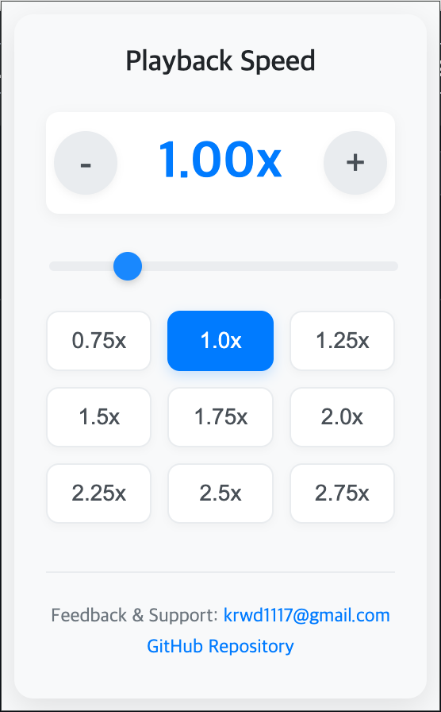

# Youtube Speed Saver

YouTube 동영상의 재생 속도를 저장하고 자동으로 적용해주는 Chrome 확장 프로그램입니다. 기본 YouTube 플레이어의 재생 속도 메뉴를 숨겨 사용자가 설정한 속도가 항상 유지되도록 합니다.

## ✨ 주요 기능

*   **자동 재생 속도 적용**: 사용자가 설정한 재생 속도를 YouTube 동영상에 자동으로 적용합니다.
*   **재생 속도 메뉴 숨기기**: YouTube 플레이어의 기본 재생 속도 메뉴를 숨겨 혼동을 방지하고 설정된 속도를 강제합니다.
*   **간편한 속도 조절**: 팝업 UI를 통해 슬라이더, 증감 버튼, 사전 설정 버튼으로 원하는 재생 속도를 쉽게 설정할 수 있습니다.
*   **속도 저장 및 동기화**: 설정된 재생 속도는 `chrome.storage.sync`를 통해 저장되어 브라우저를 닫거나 다른 기기에서도 동기화됩니다.
*   **실시간 적용**: 페이지 이동, 새로운 동영상 로드 등 DOM 변경 시에도 재생 속도를 즉시 적용합니다.

## 🚀 설치 방법

1. 'https://chromewebstore.google.com/'에 접속합니다.
2. 검색창에 'Youtbue Speed Saver'를 검색 후 설치합니다.

## 💡 사용 방법

1.  Chrome 툴바에서 'Youtube Speed Saver' 아이콘을 클릭합니다.
2.  팝업 창이 나타나면 슬라이더를 움직이거나, `+` / `-` 버튼 또는 사전 설정된 속도 버튼을 클릭하여 원하는 재생 속도를 설정합니다.
3.  설정된 속도는 자동으로 저장되며, YouTube 동영상을 재생할 때마다 해당 속도로 적용됩니다.
4.  YouTube 플레이어의 재생 속도 메뉴는 이 확장 프로그램에 의해 숨겨집니다.

## 🛠️ 기술 스택

*   HTML
*   CSS
*   JavaScript
*   Chrome Extensions API (`chrome.storage`, `MutationObserver`)

## 📷 스크린샷
